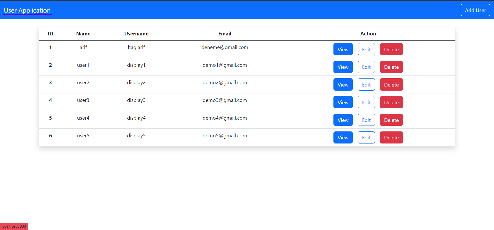
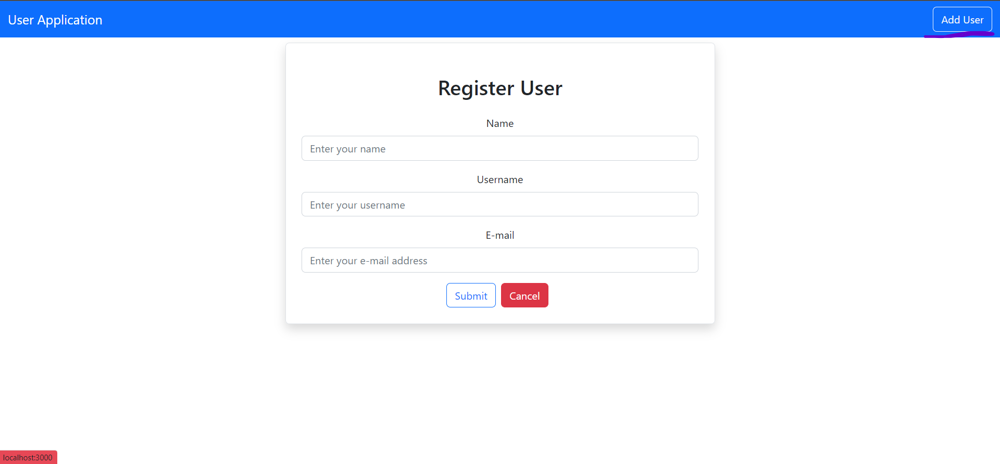
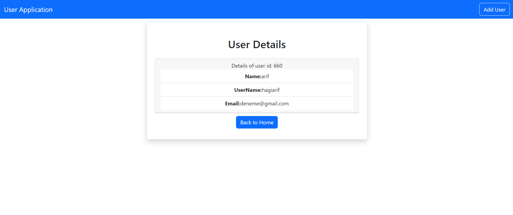
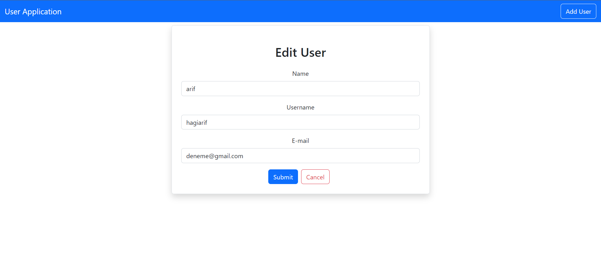
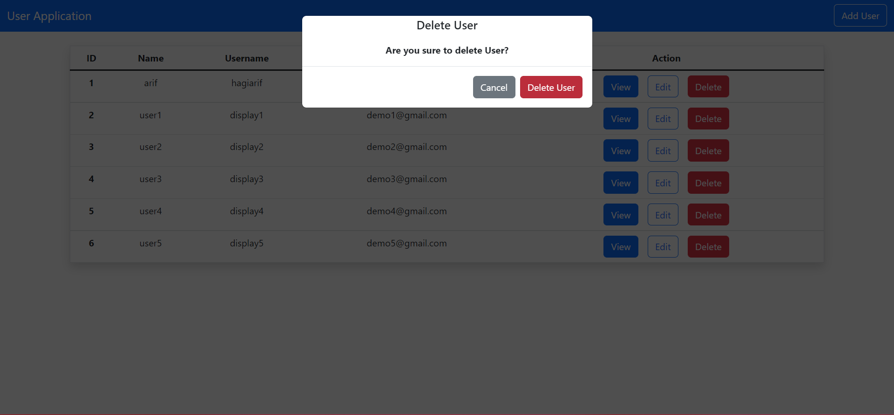

# User Application

This userApp aims to demonstrate a wide range of topics of full stack technologies. It is also aimed to demonstrate the learnings of how to implement this technologies.

## Technologies

- Some technologies used in this application are:
  - ``Java & Spring Boot``
  - ``Javascript & React``
  - ``PostgreSQL``
  - ``Intellij IDEA & Visual Studio Code``
  - ``Postman``

## Some images

- 
- 
- 
- 
- 