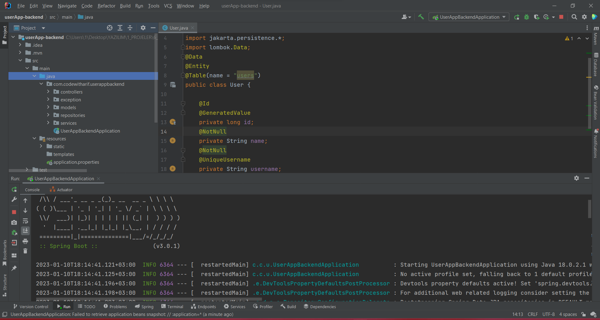
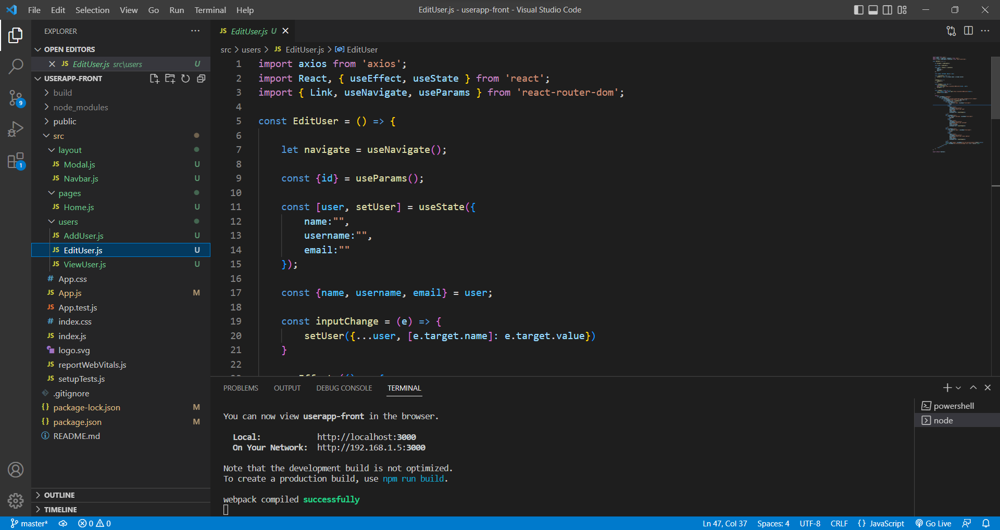
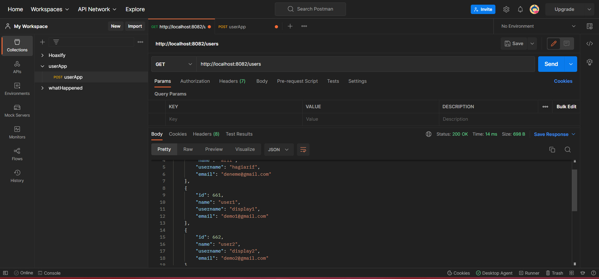
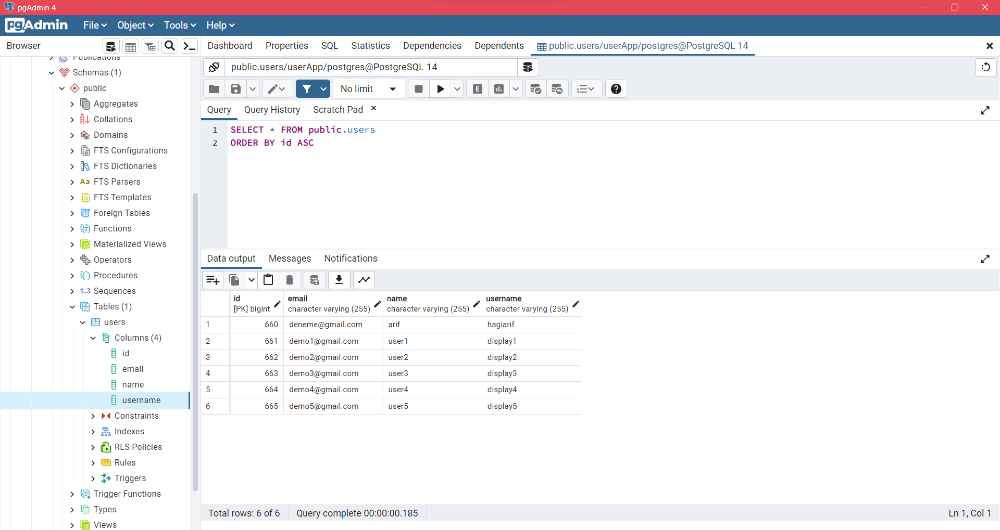

## userApp - Backend

```bash
In this application, java and spring boot were used as backend technology.
```

### images

- ``İntellij IDEA`` :



- ``Visual Studio Code`` :



- ``Postman`` :



- ``PostgreSQL`` :

